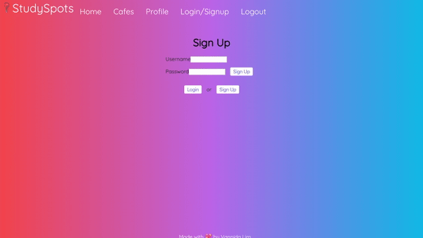

<h1 align='center'><b>Study Spots 📍📝</b></h1>  

A full stack <code>React.js</code>, <code>Redux</code> and <code>Ruby on Rails</code> web app aimed to provide
a convenient way of searching for places to study.

Built with 💖 and ✨ by <a href='https://github.com/vannida-lim'>Vannida
Lim</a>

**Demo** 
------------

**Features**
------------

StudySpots is an app that aims to provide users a convenient way to
search for studying environments. Users can search for locations
according to how late a place is open, and if it has wifi. Users will be
able to save locations to their favorites and easily access them when
signing in.

**Tech Stack**
--------------

This web app makes use of the following:

**Backend**

-   [Ruby 2.6.1](https://www.ruby-lang.org/en/)
-   [Ruby on Rails ~> 5.2.3](https://rubyonrails.org/) - MVC web framework used as an API
-   [PostgreSQL >= 0.18, < 2.0](https://www.postgresql.org/) - Database
-   [bcrypt ~>3.1.7](https://github.com/codahale/bcrypt-ruby) - Rails gem for encryption and securing user passwords
-   [Active Model Serializers](https://github.com/rails-api/active_model_serializers) - Serializing API routes to JSON
-   [Yelp-Fusion](https://github.com/erikgrueter1/yelp-fusion) - Rails gem for utilizing the Yelp Fusion API

**Front End**

-   [React.js](https://reactjs.org/) - Javascript library
-   [react-router](https://github.com/ReactTraining/react-router#readme) - NPM used for declarative routing
-   [react-redux](https://react-redux.js.org/) - React-Redux library
-   [styled-components](https://www.styled-components.com/) - CSS library
-   [google-maps-react](https://github.com/fullstackreact/google-maps-react) - NPM for utilizing the Google Maps API

**Prerequisites**
-----------------

Before you begin, ensure you have installed the latest version of:

-   [Ruby](https://www.ruby-lang.org/en/)
-   [Rails](https://rubyonrails.org/)
-   [PostgreSQL](https://www.postgresql.org/)
-   [Node.js and npm](https://nodejs.org/en/)

This web app uses the following API keys from:

-   [Google Maps Platform API](https://developers.google.com/maps/documentation)

-   [Yelp Fusion API](https://www.yelp.com/fusion)

**Installing**
--------------

*For information on Backend Installation please click here: [Study Spots Backend](https://github.com/vannida-lim/studyspots-backend)*

Frontend Installation:

-   Clone this repo to your local machine `git clone git <this-repo-url>`

-   `cd` to `studyspots-frontend`

-   Ensure your Backend API is running at `http://localhost:3000/`
-   run npm install to install all dependencies

-   run `npm install && npm start` to run dependencies and start server

-   When prompted, ensure Frontend is running at `http://localhost:3001` or another available port 

 **Component Tree**
-----------------------------------------------
